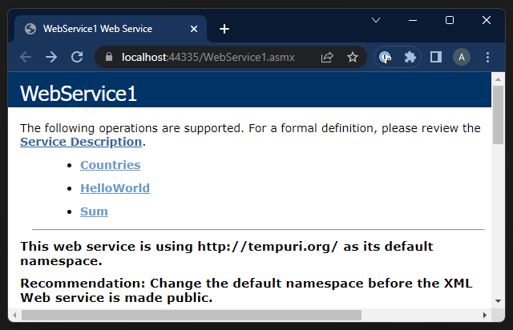
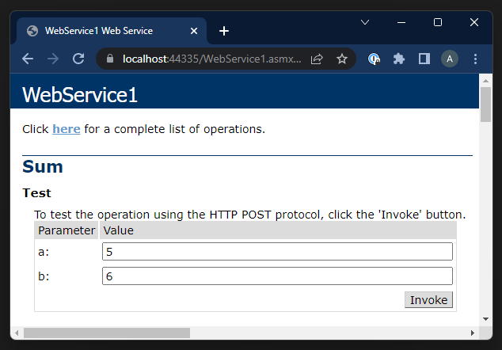
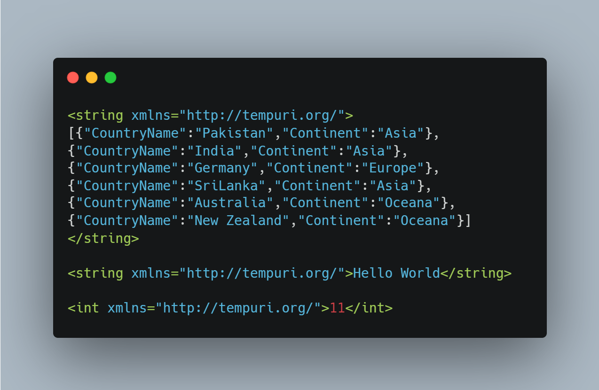

# Basic Web Service
(FSC-BCS-426-Presentation)

## Assignment Context 
This project was part of a presentation for my C# programming class. 
The goal of this assignment was for students to create a project utilizing a concept they were originally unfamiliar with, then teach the class what they learned. 
The professor had provided the class with tutorials to choose from so that each group may present a unique topic. 
My group had selected a web services tutorial made by “Coding Cafe” that introduced ASP.NET and NuGet 
for the purpose of creating a basic web-service and client-application. 

This project was made by a team of three, using C# with ASP.NET and NuGet.
Link to Client-app: https://github.com/alexander-harmaty/Basic-Client-App

## Features

Without any other explicit requirements expected, 
my group and I created a web service which used web methods for “Hello World,” 
calculating sums, and presenting a list of countries. 
On the client side app, countries list data is passed to the client via JSON and HttpGet 
where users are then able to present it in an organized table on a form. 

## Output

